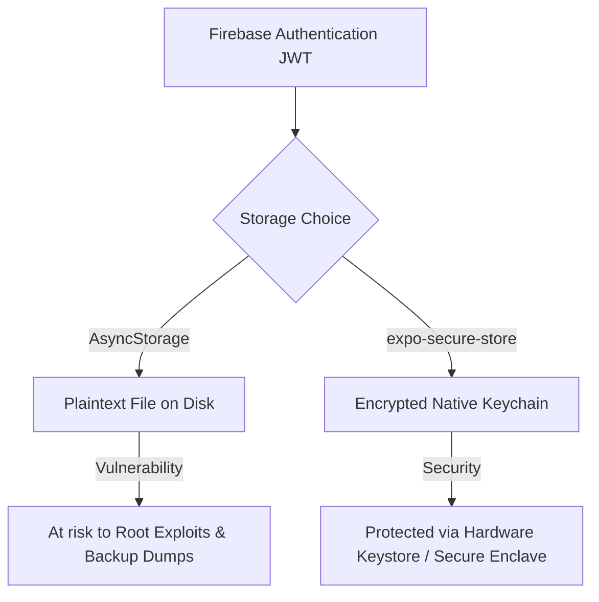

# Localization Testing & Authentication Research

This document outlines the technical research, implementation details, and architectural recommendations for the **MyClickBook** frontend project. It addresses localization testing challenges under `react-i18next` and presents a comparative study of authentication providers suitable for a React Native + Expo application.

---

## Section 1 — Localization Testing Research

Integrating localization (`react-i18next`) changes how text assets are stored, rendered, and tested. In Jest unit and integration tests, this introduces immediate failures in suites that were previously functioning.

### What Breaks in Tests After Adding Localization

* **Hardcoded Text Failures:** Tests asserting against literal UI strings (e.g., `expect(getByText('Welcome')).toBeTruthy()`) fail because the component now renders translation keys (e.g., `auth.welcome`) or is unable to resolve the key-value dictionary during runtime.
* **`useTranslation()` Jest Errors:** The React Hook `useTranslation()` relies on the `I18nextProvider` context. Running components in a bare Jest wrapper without this context throws context errors or returns undefined rendering states.
* **Snapshot Divergence:** Existing snapshot tests break immediately. Instead of clean text output, snapshots will either display missing key placeholders (e.g., `t(auth.welcome)`) or fail due to rendering nested provider trees.
* **Asynchronous Loading Bottlenecks:** Real i18n configurations load locale files asynchronously via backend plugins (e.g., `i18next-http-backend`). Jest runs synchronously by default; unresolved async resource resolutions lead to flakey, timing-dependent test failures.

---

### Required Test Updates

To resolve localization-induced test breakages, developers must implement mocking, assertion updates, and proper lifecycle management.

#### 1. Mocking `react-i18next`
Instead of wrapping every unit test in an `I18nextProvider` (which introduces execution overhead and dependency leakage), developers should mock `react-i18next` globally. This ensures that `t` returns the literal key passed to it, maintaining clear assertions.

Include the following mock block in `jest.setup.js` (or at the top of the test file):

```js
jest.mock('react-i18next', () => ({
  useTranslation: () => ({
    t: (key) => key,
    i18n: {
      changeLanguage: jest.fn(),
    },
  }),
}));
```

#### 2. Updating Hardcoded Text Assertions
With the mock active, the `t` function returns the translation key itself rather than the translated string. Assertions must be updated to expect the key.
* *Before:* `expect(getByText('Welcome to MyClickBook')).toBeTruthy();`
* *After:* `expect(getByText('auth.welcome')).toBeTruthy();`

#### 3. Snapshot Updates
After applying the mock, re-run Jest with the update flag to align snapshot baselines:
```bash
npm test -- -u
```
The snapshot will now cleanly store key structures (e.g., `"auth.welcome"`) rather than dynamic translations, making snapshots locale-agnostic and resilient to copy changes.

#### 4. Async Handling
By mocking the hook synchronously, we bypass i18next's async loading layer entirely in Jest. This guarantees deterministic execution speeds and eliminates the need for arbitrary `waitFor()` wrappers in presentational tests.

---

### Best Practices & Recommendations

* **Why Mocks are Important:** Mocking the i18n framework isolates the component under test. It eliminates dependencies on translation files, reduces test execution time, prevents async timeouts, and ensures tests validate UI logic rather than the library's internal state.
* **Avoid Testing the Library:** Do not write unit tests to verify if `react-i18next` translates text properly. Assume the library is well-tested and focus instead on verifying that the correct key is requested under specific component states.
* **Global Setup Config:** Place the Jest mock in your project's global setup file (e.g., `jest.setup.js`) specified under `setupFilesAfterEnv` in `jest.config.js` to ensure uniform coverage across all test suites automatically.

---

## Section 2 — Authentication API Research

The choice of authentication provider dictates the frontend architecture, security posture, backend integration complexity, and cost scalability. Below is a detailed technical analysis of five suitable providers for React Native and Expo.

### 1. Firebase Authentication

* **Overview:** A fully-managed, BaaS (Backend-as-a-Service) authentication utility from Google offering token-based user store, OTP, and Federated OAuth flows.
* **Expo Compatibility:** Excellent. Supports Expo Go seamlessly through standard JS SDK and Firebase Web client integrations, and production builds via `react-native-firebase` config plugins.
* **OTP Support:** Native, highly reliable SMS delivery backed by Google's global infrastructure.
* **Social Login Support:** Direct integrations for Google, Apple, Facebook, GitHub, and Twitter.
* **Scalability:** Extremely high. Seamlessly handles millions of concurrent authenticated sessions.
* **Difficulty:** Very Low. Straightforward dashboard setup and modular frontend SDKs.
* **Security Level:** Very High. Features built-in brute-force protection, Google-managed secure storage infrastructure, and standard JSON Web Token (JWT) verification models.
* **Pros:** Free tier is highly generous (up to 10,000 monthly active users for identity platform; generous phone limits depending on region); extremely fast integration; direct SDK integration.
* **Cons:** Native SDK configuration requires Expo prebuild or custom development builds for some advanced features like Recaptcha/SafetyNet SMS verification.

### 2. Auth0

* **Overview:** Enterprise-grade Identity-as-a-Service (IDaaS) focusing on highly customizable federated logins, MFA, and access control.
* **Expo Compatibility:** Moderate. Requires the use of `expo-web-browser` and `expo-auth-session` for redirect-based login, or custom native wrappers.
* **OTP Support:** Yes, via Twilio SMS or email integrations (requires third-party API keys).
* **Social Login Support:** Out-of-the-box support for over 30 social identity providers.
* **Scalability:** Enterprise-grade. Built to support heavy, complex corporate environments.
* **Difficulty:** Moderate to High. Heavy configurations, strict token mapping, and complex dashboard settings.
* **Security Level:** Maximum. Full compliance with SOC2, GDPR, HIPAA, and robust anomaly detection mechanisms.
* **Pros:** Industry-leading customization, granular RBAC (Role-Based Access Control), and powerful rule/action hooks.
* **Cons:** Highly expensive free-tier limit (capped at 7,500 active users, with rapid price scaling thereafter); complex integration overhead for Expo React Native.

### 3. Clerk

* **Overview:** Modern, developer-centric authentication platform optimized for user management, pre-built profile embeds, and rapid SaaS integration.
* **Expo Compatibility:** High. Offers a dedicated SDK `@clerk/clerk-expo` designed specifically for Expo environments.
* **OTP Support:** Built-in support for passwordless SMS and email OTP.
* **Social Login Support:** Strong support for standard social SSO providers.
* **Scalability:** High. Scaled on modern serverless infrastructure.
* **Difficulty:** Very Low. Tailored developer experience with minimal configuration required.
* **Security Level:** High. Follows modern security patterns with automatic session rotations and CSRF defenses.
* **Pros:** Beautiful pre-built React components, superior developer experience, and native Expo support.
* **Cons:** Component templates are tailored primarily for Web (React/Next.js); React Native UI components are less customizable and rely heavily on Webview fallbacks or custom UI state reconstruction. High pricing scale.

### 4. Supabase Auth

* **Overview:** An open-source Go-based authentication solution integrated directly into Supabase's PostgreSQL database service.
* **Expo Compatibility:** High. Standard JavaScript client library (`@supabase/supabase-js`) integrates smoothly without native compilation issues.
* **OTP Support:** Supported via external SMS providers (Twilio, MessageBird, Vonage).
* **Social Login Support:** Standard OAuth integrations (Google, Apple, Discord, etc.).
* **Scalability:** Medium to High. Tied directly to the underlying PostgreSQL database limits and connection pools.
* **Difficulty:** Low. Simple to spin up if using the Supabase backend ecosystem.
* **Security Level:** High. Integrates row-level security (RLS) policies directly into database tables using authenticated JWT payloads.
* **Pros:** Open-source, directly connects to PostgreSQL database, highly cost-effective, and transparent open-source code base.
* **Cons:** Relies on third-party provider APIs for SMS/OTP; database connection overhead; lacks specialized stand-alone auth features if divorced from the Supabase ecosystem.

### 5. Custom JWT Backend

* **Overview:** A self-hosted authentication service built by internal engineering teams (e.g., using Node.js, Express, Passport.js, and Redis).
* **Expo Compatibility:** Native. Relies entirely on custom RESTful endpoints (`/api/login`, `/api/signup`) using standard HTTP clients (Axios/Fetch).
* **OTP Support:** Custom implementation required (connecting manual endpoints to Twilio, AWS SNS, or Plivo).
* **Social Login Support:** Requires manual handling of OAuth redirects, token exchanges, and profile sync logic.
* **Scalability:** Requires engineering overhead. Scalability rests entirely on internal infrastructure capacity, load balancers, and cache layers.
* **Difficulty:** Extremely High. Complete development, maintenance, and security lifecycle is handled internally.
* **Security Level:** Variable. Highly dependent on engineering competency; vulnerable to data leaks, improper token validation, and weak hashing algorithms if misconfigured.
* **Pros:** Absolute architectural control, zero vendor lock-in, zero external service fees, and custom data-residency compliance.
* **Cons:** High maintenance costs, major development overhead, risk of security vulnerabilities, and slow implementation cycles.

---

## Section 3 — Comparison Table

| Feature | Firebase | Auth0 | Clerk | Supabase | Custom JWT |
| :--- | :--- | :--- | :--- | :--- | :--- |
| **Expo Support** | **Excellent** (Native + JS) | **Moderate** (Redirects) | **Excellent** (Clerk-Expo) | **Excellent** (JS SDK) | **Excellent** (Standard REST) |
| **Phone Auth (OTP)**| **Native** (Google Infra) | **Supported** (Paid Add-on)| **Native** (Built-in) | **Supported** (Requires Twilio) | **Custom** (Manual integration) |
| **Social Login** | **Strong** (Google/Apple/etc)| **Exceptional** (30+ SSO) | **Strong** (Modern SSO) | **Strong** (Direct PG link) | **Custom** (Manual callback logic) |
| **Ease of Integration**| **Very High** | **Medium** | **High** | **High** | **Low** |
| **Scalability** | **Extremely High** | **Extremely High** | **High** | **Medium-High** | **Developer-dependent** |
| **Security** | **Google-Managed** | **Enterprise Grade** | **Highly Secure** | **DB Row-Level Security** | **Developer-dependent** (High Risk) |
| **Setup Complexity** | **Low** | **High** | **Very Low** | **Low** | **Extremely High** |
| **Maintenance** | **Minimal** (BaaS) | **Minimal** (SaaS) | **Minimal** (SaaS) | **Low** (Managed DB) | **Critical** (Continuous overhead) |
| **Cost** | **Generous Free Tier** | **Expensive** (SaaS scale) | **Expensive** (SaaS scale) | **Highly Cost-Effective** | **High Infrastructure/Ops Cost** |

---

## Section 4 — Why Firebase Is Best For MyClickBook

For a fast-growing startup application like MyClickBook, **Firebase Authentication** stands out as the optimal technical and strategic solution. Below are the key drivers for this decision:

### 1. Optimized for React Native & Expo
Firebase integrates effortlessly into the Expo ecosystem. Using the Firebase JS SDK for rapid prototyping during early development stages, or transitioning to `@react-native-firebase` with Expo config plugins for native performance, provides maximum architectural flexibility.

### 2. High-Performance Phone OTP Signup
MyClickBook requires a robust, frictionless phone number OTP signup flow. Firebase provides native SMS verification backed directly by Google's global infrastructure. It handles:
* Automatic application verification verification states.
* Built-in spam prevention and bot detection (reCAPTCHA and device verification).
* High message delivery success rates globally, avoiding expensive third-party SMS middleware setups like Twilio.

### 3. Rapid Startup MVP Development
Firebase Authentication drastically reduces time-to-market. Frontend developers can configure authentication with just a few lines of code, bypassing the need to write backend database tables, hashing routines, password-reset mail loops, and session tracking.

### 4. Seamless Social Logins
The application can easily expand beyond OTP to support Google and Apple sign-ins using Firebase's unified OAuth interface, presenting a singular client-side token format to the application backend.

### 5. Secure Token Architecture
Firebase handles token issuance, rotation, and validation out-of-the-box. It yields secure, short-lived JSON Web Tokens (JWT) containing unique user IDs (`uid`), easily verifiable on the Node.js backend using the `firebase-admin` SDK.

---

### Token Storage: `expo-secure-store` vs `AsyncStorage`

We recommend utilizing **`expo-secure-store`** for persisting user session tokens on the mobile device, rather than standard `AsyncStorage`.



* **Storage Mechanisms:** `AsyncStorage` saves data as unencrypted plaintext JSON on the device's persistent storage. If a device is rooted, jailbroken, or physically compromised, an attacker can extract these long-lived authentication tokens directly from the file system.
* **Hardware-Level Encryption:** `expo-secure-store` utilizes device-specific hardware-backed secure storage solutions: **Keychain** on iOS and **Keystore/Secure Preferences** on Android. 
* **Regulatory Compliance:** Storing highly sensitive user keys in an encrypted hardware vault is critical to meet modern security compliance metrics and ensures the application is store-submission ready.

---

## Section 5 — Recommended Architecture

The recommended technology stack balances development velocity, data-privacy standards, high-throughput capability, and scalable infrastructure:

| Layer | Recommended Technology | Rationale / Key Responsibility |
| :--- | :--- | :--- |
| **Frontend** | React Native + Expo | Multi-platform compilation (iOS/Android) from a single TypeScript codebase using Expo’s robust developer workflow. |
| **Localization** | `react-i18next` | Multi-language translation management, locale caching, and scalable JSON-based dictionary formats. |
| **Authentication** | Firebase Auth | Secure identity provider managing OAuth flow, JWT creation, and direct phone SMS-OTP validations. |
| **Token Storage** | `expo-secure-store` | Hardware-encrypted client-side keystore for local persistence of access tokens. |
| **Backend API** | Node.js + Express | Lightweight, async event-driven RESTful application layer to verify JWT signatures via the `firebase-admin` library. |
| **Database** | PostgreSQL | Enterprise-grade relational database to store business-critical user profiles, relational models, and transactional logs. |

---

## Section 6 — Final Recommendation

1. **Strategic Selection of Firebase:** Firebase Authentication represents the most complete, cost-efficient, and secure identity provider for the MyClickBook MVP. Its native OTP verification pipelines bypass complex SMS gateway configurations, and its JWT ecosystem guarantees easy, secure handshakes with the Node.js API layer.
2. **Localization Integration Strategy:** Integrating `react-i18next` is necessary for global scaling but directly impacts existing unit tests. Engineers must proactively configure global Jest mocks for localization hooks to prevent test suite regressions.
3. **Execution Directive:** Ensure that all active test suites are updated to assert on i18n *keys* rather than *literal copy* before merging the localization branch into the main repository branch.
