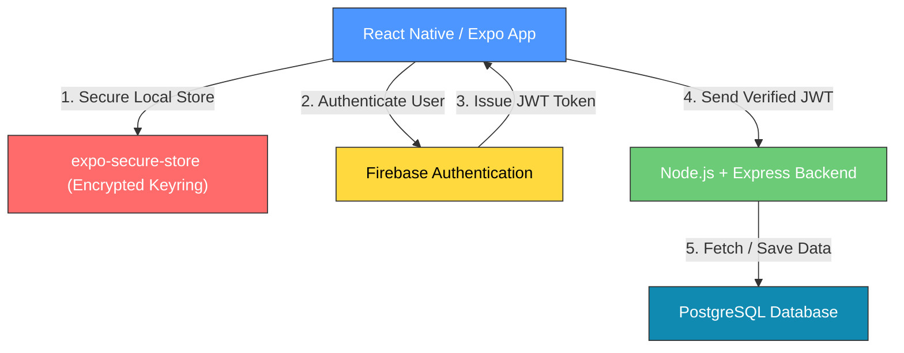
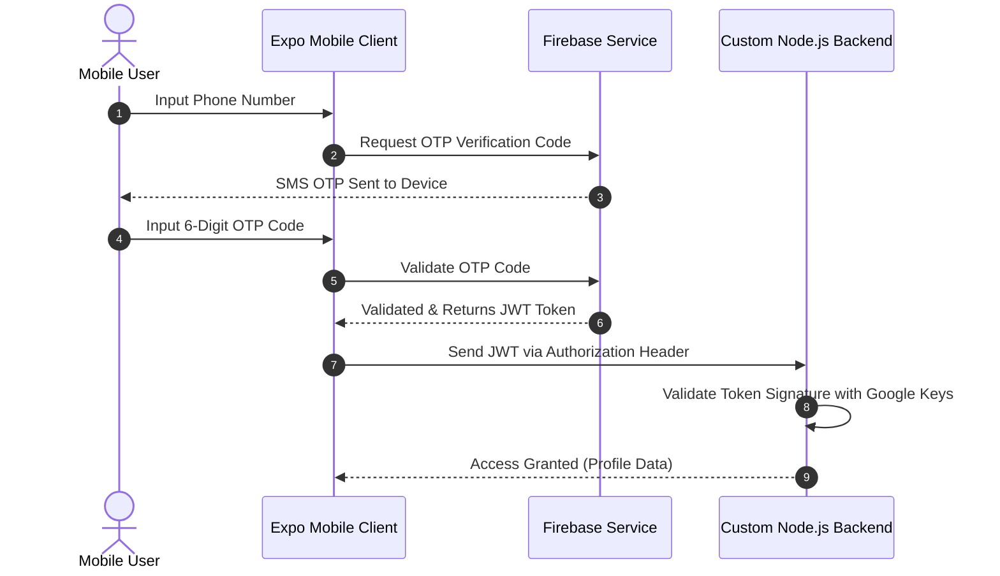
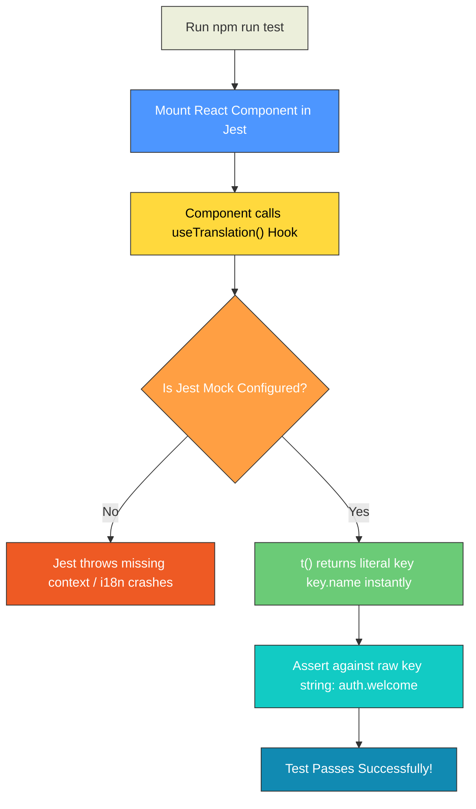

# Localization Testing & Authentication Research

A quick-reference guide designed for a **5-minute live technical meeting** or internship review. 

---

## 1. Localization Testing (Why It Breaks & How to Fix)

### What Breaks & Why
* **Hardcoded Text Fails:** Tests search for literal UI strings (like `"Welcome"`), but the UI now displays translation keys (like `"auth.welcome"`).
* **Missing Context Errors:** The `useTranslation()` hook throws errors in Jest because the wrapping `I18nextProvider` is missing from the test environment.
* **Broken Snapshots:** Component snapshots change from readable English strings to dynamic i18n keys, failing existing test baselines.
* **Async Loading Timeouts:** Jest runs synchronously, but real translation files load asynchronously, causing flaky test runs.
* **The Solution:** Global mocking intercepts translation requests and synchronously returns translation keys as strings.

### The Solution Flow


### Simple Jest Mock
Add this code block inside `jest.setup.js` to fix i18n issues globally:
```js
jest.mock('react-i18next', () => ({
  useTranslation: () => ({
    t: (key) => key,
    i18n: { changeLanguage: jest.fn() },
  }),
}));
```

---

## 2. Authentication APIs (Simple Comparison)

* **Firebase Auth:** Google-backed, built-in phone OTP, extremely generous free tier, fast setup.
* **Auth0:** Enterprise-grade security, highly customizable, but expensive and complex for startup MVPs.
* **Clerk:** Excellent developer experience and prebuilt widgets, but premium pricing and web-focused.
* **Supabase Auth:** Great if using the Supabase Postgres ecosystem, but requires external APIs for SMS/OTP.

### Feature Matrix

| Feature | Firebase | Auth0 | Clerk | Supabase |
| :--- | :--- | :--- | :--- | :--- |
| **Expo Support** | **Excellent** | **Moderate** | **Excellent** | **Excellent** |
| **Phone Auth (OTP)**| **Native (Free tier)**| **Paid Add-on** | **Native** | **Requires Twilio**|
| **Setup Complexity**| **Very Low** | **High** | **Very Low** | **Low** |
| **Security** | **Google-Managed** | **SOC2 Compliant**| **Modern / Solid**| **Postgres RLS** |
| **Cost** | **Free / Cheap** | **Very Expensive**| **Expensive** | **Cost-Effective**|

---

## 3. Why Firebase is Best

* **Native Expo Harmony:** Works perfectly on Expo Go during development and natively in production builds.
* **Frictionless Phone OTP:** Native global SMS delivery backed by Google’s high-performance infrastructure.
* **Zero Boilerplate:** Sets up in minutes—no database design, custom backend routes, or SMTP mail servers needed.
* **Google-Managed Security:** Highly secure token issuance and automated spam/abuse detection.
* **Ultimate Cost Efficiency:** Up to 10,000 monthly active users are free, perfect for a startup MVP.

### Simple Architecture Diagram



---

## 4. Signup API Flow



---

## 5. Localization Test Flow



---

## 6. Recommended Tech Stack

| Layer | Technology | Primary Purpose |
| :--- | :--- | :--- |
| **Frontend** | **React Native + Expo** | Quick multi-platform compilation & high productivity. |
| **Localization**| **`react-i18next`** | Seamless translation hooks and structured translations. |
| **Authentication**| **Firebase Auth** | High-reliability, low-cost phone OTP signup flow. |
| **Secure Token Storage**| **`expo-secure-store`** | Secure hardware-level (Keychain/Keystore) encryption. |
| **Backend API**| **Node.js + Express** | High concurrency async server verifying Firebase tokens. |
| **Database** | **PostgreSQL** | Structured relational models and atomic data safety. |

---
